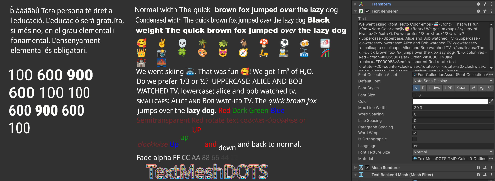
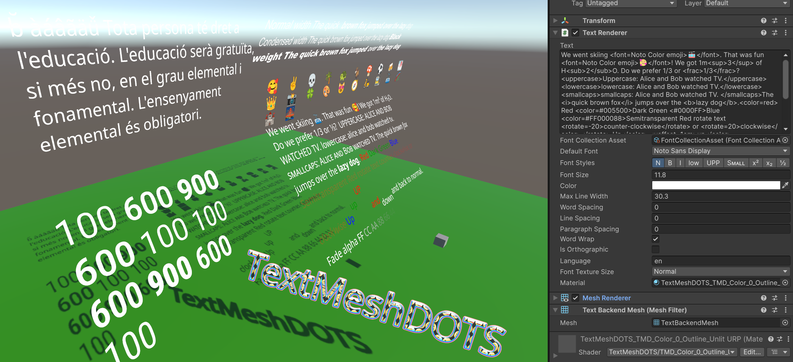

# TextMeshDOTS

TextMeshDOTS renders world space text similar to TextMeshPro. It is a standalone text package for DOTS, 
forked from Dreaming381's [Latios Framework/Calligraphics](https://github.com/Dreaming381/Latios-Framework/tree/master/Calligraphics). 

<b>Font Support</b> Powered by [Harfbuzz](https://harfbuzz.github.io/), TextMeshDOTS is currently able to load regular and variable TrueType and OpenType fonts, as well as TrueType Collection fonts. Fonts can either be included as an asset, or searched at runtime among the system fonts available on a given target platform (Windows, Linux, MacOS etc). Selection of font 
family members ([variants](https://learn.microsoft.com/en-us/typography/opentype/spec/otvaroverview)) that differ in properties such as regular/italic, font weight (normal, bold, thin, etc), font width (normal, condensed, expanded etc), slant, optical size etc is done per `TextRenderer` via rich text tags defining the desired font family and variant properties. If 
no matching font variant for the defined properties can be found, TextMeshDOTS falls back to the font family, and is able to simulate bold and italic. In case a font does not contain a user provided unicode character or emoji, TextMeshDOTS is (for performance reasons) currently not searching for a fall back font that does contain the desired character - so be sure the selected font contains the characters or emoji you need. 

 

<b>Rich Text:</b> TextMeshDOTS supports many rich text tags like [TextMeshPro](https://docs.unity3d.com/Packages/com.unity.textmeshpro@4.0/manual/RichText.html) and TextCore (see section below for details). User selectable [opentype features](https://learn.microsoft.com/en-us/typography/opentype/spec/featurelist) can be enabled using rich text tags such as \<sub\> (subscript), \<sup\> (superscript), \<frac\> (fractions), \<smcp\> (smallcaps).

<b>Color Emoji :-)</b> TextMeshDOTS is as of version 0.9.0 capable to render [COLR v0 and v1](https://developer.chrome.com/blog/colrv1-fonts) emoji fonts. Version 0.9.7 added support for PNG and SVG based emoji fonts (and any kind of other bitmaps that come with fonts), 
thanks to new harfbuzz internal rasterizer (that also happens to be 4-5x faster).

<b>Slug base GPU renderer</b> Eric Lengyel kindly donated his slug algorithm to the [public](https://terathon.com/blog/decade-slug.html). Using his approach, no textures are needed. Instead the font bezier curves are sampled directly on the GPU. The result is ""infinite" detail when zooming in. Rendering cost is higher compared to the texture approach (unless you use the "massive" texture setting). Harfbuzz was very quick to implement a [GPU based renderer](https://harfbuzz.github.io/harfbuzz-hb-gpu.html) in version 14.2.0, so it was straight forward to add this option also to TextMeshDOTS as of version 0.9.9. 

# Technical Foundation

<b>Unity DOTS:</b> TextMeshDOTS leverages the [Unity Entities](https://docs.unity3d.com/Packages/com.unity.entities@1.2/manual/index.html) package, BURST, and jobs to generate all data required for rendering, and [Unity Entities Graphics](https://docs.unity3d.com/Packages/com.unity.entities.graphics@1.2/manual/index.html) for rendering.

<b>Font Resource Management</b> Prior to version 0.9.0, TextMeshDOTS used for each font a static atlas textures, borrowed from the Unity `TextCore` `FontAsset`. As of version 0.9.0, TextMeshDOTS generates all required glyph data and font textures dynamically using the [Harfbuzz](https://harfbuzz.github.io/) library, was however limited to one 4k atlas texture per font. Handling multiple fonts remained challenging, which prompted Dreaming381 to vastly simplify resource management by storing all SDF and color bitmaps in global atlas texture arrays. Dreaming381 also implemented a GPU resident representation of the glyph vertex data. 
These GPU resident buffers are automatically and incrementally updated when changes occur. As of version 0.9.9, the optional slug based renderer does not use texture arrays, and rather uses a linear buffer containing the font data the slug shader needs to render the font directly from outlines.

<b>Shader Support</b>
There are two different versions. The included HDRP and URP ShaderGraph shader are based on a number of custom function nodes to provide modularity for decoding the GPU resident vertex data, sampling of the SDF or bitmap texture array, adding up to three outlines to SDF glyphs, as well as colorizing/texturing SDF glyphs and outlines. Different shader variants are provided, with the most complex shader providing feature parity to the TextMeshPro 4.0 SRP shader. The modularity of the 
shader design enables users to expand on the provided examples and define their own custom shader. For a given text label (`TextRenderer`) that makes use of different fonts and emoji, TextMeshDOTS needs as of version 0.9.5 just one entity and one material. The alternative slug rendering mode does not (yet) support face textures or outlines (but is *very* crisp!).

# Autoring workflow
## Setup of Materials, Rendering Mode, Fonts
 - **Import Shader** Open the package manager, select "Samples", and import either the URP or HDRP shader.	The resources will be imported to the folder `Assets/Samples/TextMeshDOTS/Version/Sample Name`. You can move them anywhere you like. Generate a material as usual (right click on desired shader --> Create --> Material). For the slug based GPU rendering mode, use a shader that contains the word "Slug".
 
 

  - **Selection of Rendering Mode** TextMeshDOTS offers two rendering modes (1) Texture based and (2) slug based GPU rasterization. Mixing both modes would make the GPU resource handling significantly more complex and error prone. The GPU rendering mode can be enabled via Project Setting -> TextMeshDOTS -> GPU Rendering Slug. This generates a `TextMeshDOTSSettings.asset` in the project asset folder. In this mode, all `TextRenderer` material need use the TMD_Color_Slug_URP or TMD_Color_Slug_HDRP shader. The slug rendering mode does not support face textures or outlines (but is *very* crisp!). If you need that, or have performance concerns then use the normal CPU based rasterization / texture based rendering.
   
 

  -  **Prepare Fonts** Please note that pretty much any font such as "Arial" in Windows actually consists of multiple font files (e.g. one for `regular`, one for `bold`, one for `italic`, one for `bold italic`. There can be many more to provide variations of font width (regular, condensed, expanded etc), font weight (bold, semibold, black etc), italic, different optical design sizes etc. You need all of these files to enable TextMeshDOTS to automatically select the right font when you apply different `FontStyles`. In TrueType Collection fonts, a number of pre-defined variants are stored within just one `ttc` file. Variable fonts are similar to TrueType Collection fonts, however the files are much smaller because the variants are mathematically defined via parameters influencing the shape of the bezier curves. TextMeshDOTS 
   can simulate bold and italic when those variants are missing, however this should be the exception and not the default.
      1. To use `System Fonts` (fonts that can be found on target device at runtime), drop the `ttf` `ttc` and `otf` files into a folder of your choice under `Assets`. Click on the font asset and uncheck `Include Font Data` to ensure the file is *not* included in your build. You might wonder why to even add such fonts to your project: this is only needed to extract some data to be able to correctly identify the desired fonts at runtime on the target device. 
      2. To use `Embedded Fonts`, create under `Assets` a subfolder called `StreamingAssets`. Drag and drop all `ttf` `ttc` and `otf` files you intend to use there. You can organize fonts in further subfolders as you wish.  
      3. Create a `FontCollectionAsset` scriptable object: `Any folder under Assets --> Right click --> Create --> TextMeshDOTS --> FontCollectionAsset`
      4. Drag and drop the fonts prepared in the first 2 steps into the respective lists
      5. Click `Process!`
      
 

 
## Baking: Subscenes, Config Singletons, `TextRenderer` entities
  - **Config Singletons**
      -	**`FontCollection` Singleton**. This singleton provides all the data needed to load the fonts and populate the global font tables used by TextMeshDOTS.
        - Add empty `GameObject`, add `FontCollection` component to it
        - Drag and drop the `FontCollectionAsset` into the provided field    
    - **`TextColorGradient` Singleton** (optional): This singleton provides the required data to select color gradients via rich text tags.
        - Add empty `GameObject`, and `TextColorGradient` component to it
        - Add any number  gradients to the list. You need to name the gradients to be able to select them via the rich text tag \<gradient=name of gradient\> For horizontal gradients, specify at least the top left & right color. For vertical gradients at least top & bottom-left. Otherwise specify all corners.
  - **TextRenderer**
    - Add empty `GameObject`, add `TextRenderer` component to it. Add optional tag components in case you like to be able to use an `EntityQuery` to process a given `TextRenderer` in systems that change the label (e.g. to display damage status on a character)
    - **Font Collection Asset** Drag & drop `FontCollectionAsset` into this field. Without it you cannot select any fonts and this TextRenderer will not render.
    - **Default Font** Select a the base font family to be used by this `TextRenderer`. You can override this using rich text tags.
    - **Layout Options** Select Font styles, size, color, max line width, word/line/paragraph spacing, word wrap, orthographic mode
      - you can change font styles also using rich text tags such as \<b\> (bold), \<i> (italic). The \<font\> rich text tag can be used to explicitly select a different font family.
    - **Language** enter [BCP 47](https://en.wikipedia.org/wiki/IETF_language_tag#List_of_common_primary_language_subtags) conform tags to set the language of this text. This ensures correct text shaping by harfbuzz (conversion of unicode characters into glyphs)
     - **Font Texture Size**: Ignored when using the [Slug](https://terathon.com/blog/decade-slug.html) based GPU render mode, which renders "infinite" detail directly from the bezier curves. Otherwise select here the sampling size for rasterizing glyphs 
       - Normal: 96px SDF (8bit), 128px color bitmaps (32bit)
       - Big: 128px SDF (16bit), 512px color bitmaps (32bit)
       - Massive (**WARNING**): 256px SDF (16bit), 2048px color bitmaps (32bit)
         - a few hundred glyphs will fill all your GPU memory!
    - **Material** Use material of your choice (generated in the first step) into the respective field. Ensure the material is compatible with the selected render mode (Slug or texture).
    - **Text** Type in some text or rich text. If you followed all the steps above, you should now see the text as you type.

 
      
  

# Runtime workflows
  ## Changing text at runtime
  Text is stored in the `CalliString` DynamicBuffer. Query for that buffer and change it. Identify `TextRenderer` of your choice via `EntityQuery` by adding optional tag components.
## Spawning of `TextRenderer` at runtime
  - Runtime spawned `TextRenderer` need a material registered with Entity Graphics. In order to do that, you need to bake a	`TMD Runtime Material`: add an empty `GameObject`, add `TMD Runtime Material` component to it. Drop one of the materials you generated in first step of the authoring workflow (see above) into the material field. 	
  - Write a runtime `TextRenderer` spawner. You can follow the approach found in the package folder `TextMeshDOTS\RuntimeSpawner\RuntimeTextRendererSpawner.cs` (enable auto creation of this system to see a demo of runtime spawning once you enter play mode). The general workflow for runtime spawning is as follows:
	- Create the `TextRenderer` archetype via `TextRendererUtility.GetTextRendererArchetype()` or 
	 `TextRendererUtility.GetDepthSortedTextRendererArchetype()`
	- query for singleton with the `IComponents` `RuntimeFontMaterial` and `RuntimeLanguage` in order to retrieve `MaterialMeshInfo` and runtime language `BlobAssetReference<LanguageBlob>`
	- create `TextBaseConfiguration` via `TextRendererUtility.GetTextBaseConfiguration()`
	- use `EntityManager` or `EntityCommandBuffer` to create entity of the `TextRenderer` archetype 
	- use `AddComponent(Entity e, in ComponentTypeSet componentTypeSet)` overload to add any number of additional `IComponent`
	- set all component data

## Optional runtime font instantiation workflow
  In case you like to load fonts while your app is running, you can use the approach found in the package folder `TextMeshDOTS\RuntimeSpawner\RuntimeFontSpawner.cs`. You will notice, that you need to manually fill out a lot of information in the `FontLoadDescription` struct for every font you intend to use. This information can be extracted utilizing the `FontUtility` Scriptable Object.  
  - Right click in a folder, then `Create --> TextMeshDOTS --> Font Utility`. Click on the lock icon (top right) to lock this view in the inspector)
  - Navigate to your font files. Drag and drop the fonts from `StreamingAssets` (or from anywhere else in your project in case you intend to use `System Fonts`) into the font field. The font file will be parsed to extract the information from all available faces (or predefined variable profiles) in the font file.  Use this information to build a `FontLoadDescription` in your runtime spawner. See the provided example in TextMeshDOTS\RuntimeSpawner\FontLoadDescription.cs. 
  - I know this is cumbersome, and in order to improve the workflow I would love to hear about your concrete use cases that would require dynamic loading of fonts at runtime.
    
 
  

# Supported rich text tags

\<align=...\> \<allcaps\>, \<alpha=xx\>, \<b\>, \<color=...\>, \<cspace=xx\>, \<gradient=...\> \<font=...\>, \<font-weight=xxx\>, \<font-width=xxx.x\>, \<fraction\>, \<i\>, \<indent=xx\> \<lowercase\>, \<sub\>, \<sup\>, \<size=xx\>, \<space=000.00\>, \<mspace=xx.x\>, \<smallcaps\>, \<scale=xx.x\>, \<rotate=00\>, \<voffset=00\>.  Permitted size units are 'pt','px', 'em' and '%' or nothing (e.g. font-weight, font-width). Permitted values for named colors (\<color=red\>) are red, lightblue, blue, grey, black, green, white, orange, purple, yellow. String values (such as named colors or font names) are recognized with and without surrounding quotation marks. Hexadecimal colors are either specified using the color keyword \<color=#005500\>, or directly without the color keyword as  \<#005500\>. Alpha values are specified via \<alpha=#FF\>.

# Known issues
  - \<align\> works only for left, center and right (not justified and flush)
  - \<sub\> and \<sup\>  are currently implemented using the font opentype feature. For most fonts, this only works  for digits and a few characters. One could simulate \<sub\> and \<sup\> for all glyphs via scaling & offsetting, but this comes at the cost of glyphs that are optically too thin. The code for switching from one to the other is present and you could locally modify the package if you desire.

## Special Thanks to the original authors and contributors

-   Dreaming381 - not only has he created the amazing [Latios Framework](https://github.com/Dreaming381/Latios-Framework), 
   including the Calligraphics text module, but has also been of tremendous support in figuring out how to create 
   a standalone version of Calligraphics that uses Entity Graphics instead of the Kinematic rendering engine. 
   Furthermore, Dreaming381 made the harfbuzz library accessible as plugin across platforms via the
   [HarfbuzzUnity](https://github.com/Dreaming381/HarfbuzzUnity) plugin for MacOS, Linux and Windows, and 
   implemented the core systems for managing the texture arrays and glyph rendering.
-  Sovogal – significant contributions to the Calligraphics module of Latios Framework (including the name)
